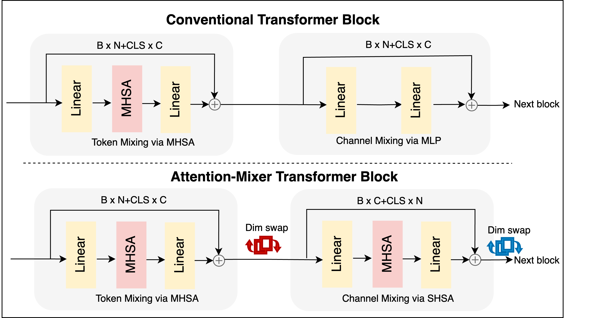

# CA-ViT: Channel-Aware Vision Transformers for Dynamic Feature Fusion

This repository contains the official PyTorch implementation of **CA-ViT**, a lightweight Vision Transformer that replaces static MLP-based channel mixing with dynamic attention across feature channels.

> 📄 **Paper**: _CA-ViT: Channel-Aware Vision Transformers for Dynamic Feature Fusion_  
> 📍 **Venue**: Transformers for Vision (T4V) Workshop @ CVPR 2025  


## 🧠 Overview

CA-ViT is a minimal yet powerful extension to standard Vision Transformers (ViTs). It introduces a second attention mechanism per Transformer block that operates over feature channels via a simple dimension swap. This allows:

- Dynamic, data-dependent feature fusion across channels  
- Enhanced global context modeling  
- Reduced parameter count and FLOPs, with improved accuracy  

<p align="center">
  
</p>

## 🚀 Features

- Dual-attention ViT block (spatial + channel attention)
- Drop-in replacement for MLP in ViT blocks
- Clean implementation using [timm](https://github.com/huggingface/pytorch-image-models)
- Visualization utilities for token attention maps
- Lightweight and reproducible experiments on 5 benchmark datasets


---

## 📦 Setup

```bash
# Create virtual environment
python -m venv cavit-env
source cavit-env/bin/activate  # or .\cavit-env\Scripts\activate on Windows

# Install dependencies
pip install -r requirements.txt

# Run Script
python main.py --dataset pneumoniamnist \
               --epochs 100 \
               --batch_size 128 \
               --image_size 224 \
               --patch_size 16
```

## 🧠 Citation
- If you use this work, please cite us:

@inproceedings{Aon2025cavit,
  title     = {CA-ViT: Channel-Aware Vision Transformers for Dynamic Feature Fusion},
  author    = {Aon Safdar and Mohamed Saadeldin},
  booktitle = {CVPRW: Transformers for Vision (T4V)},
  year      = {2025}
}

## 📨 Contact
Feel free to raise an issue or contact me at [aon.safdar@ucdconnect.ie](mailto:aon.safdar@ucdconnect.ie) for queries and discussions.


